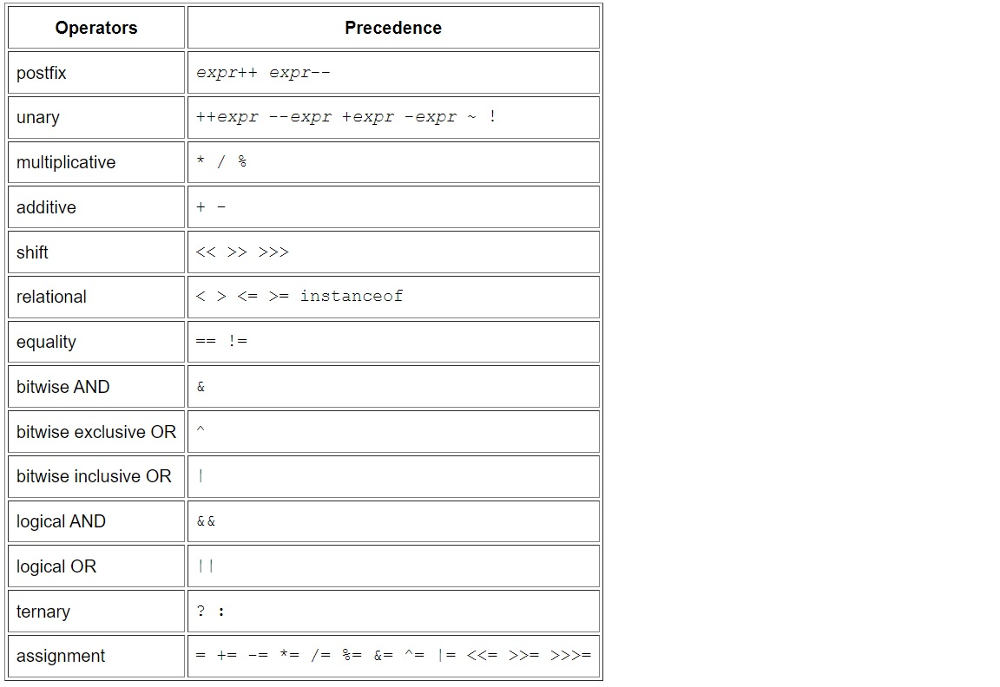

# Java Basics 

## Variables 

Java defined many types of variables: 

1. Instance Variables (Non-Static): declared with the keyword Static, can't declare them more than once for one object.
2. Class Variables (Static): declared as static to mean it is a copy of a variable.
3. Local Variables: declared in a specific scope or method and can not used any where outside that scope.
4. Parameters: variables that are passed to a method between parantheses.
   

How to name variables in java: 

* variable can contain letters, numbers and two kinds of special characters( _ , $). 
* java is case sensetive 
* should start with letter not digits and can start with ( _ or $). 
* can not be keyword or whitespace.

> int num = 0; // decaring number and assign its value to 0.
--------------------------------------------------------------------------------------------------------------------------

## Operators in Java

* Java have many types of operators, as shown in the table 
* the operator takes maybe two or three operands 
* the operators used in the arithmatical and logical expressions and to assign values.

> int x;

> x >= 5 ;

----------------------------------------------------------------------------------------------------------------------------

## Expressions, Statements, and Blocks

### Expressions :

 construct used variables, operators, method invocations and its return type is boolean.
 > int x = 0;

 > int result = result + 2;

### Statements

it could be : Assignment expressions, use of ++ or -- , Method invocations and Object creation expressions

> int x = 1 + 2;     // result is now 3
>
>if (x == 3) 
>
>  System.out.println("they are equals");

### Blocks 

lines of codes within a method or curly brackets 

> public static void main (string [] args)
>{
>   
>   if (x % 2 == 0 )
>
> system.out.println("even number);
>
>}  // code inside { and } is a block 

--------------------------------------------------------------------------------------------------------------------------
## Control Flow Statements

statements are excuted from top to bottom but it breaked if there is a dessicion 

* If statements 

* Loop statements 

* Switch cases
