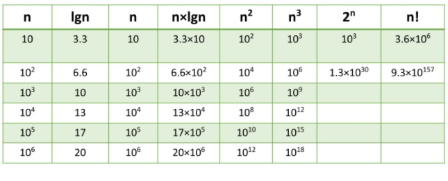
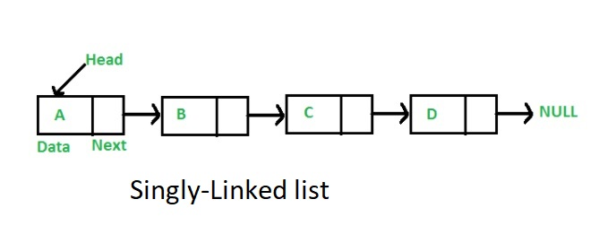
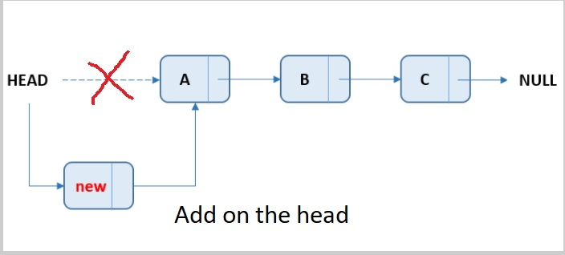
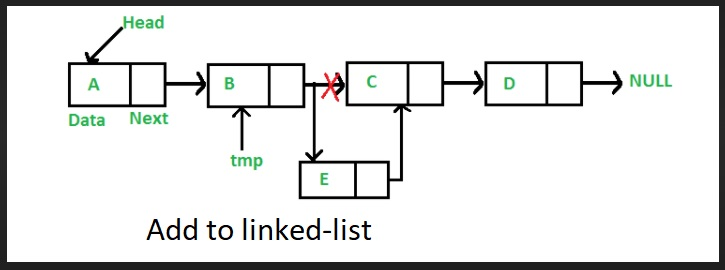

# 
# Big O: Analysis of Algorithm Efficiency

Big(O) notation is used to describe the efficiency of algorithm or function. 
This efficiency is evaluated based on:
- Running Time, (time efficiency / complexity):The amount of time a function needs to complete

- Memory Space: (space efficiency / complexity): The amount of memory resources a function uses to store data and instructions.

- describe the *Worst Case* of efficiency an algorithm 

-  to analyze time & space factors, consider 4 Key Areas for analysis: 

###### Input Size
size of the parameter values that are read by the algorithm, akes into account the size of each parameter value as well.

use the letter n to refer to the Input Size value, if n increases it increase the running time ane memory space

###### Units of Measurement

 To quantify the Running Time consider Three Measurements of time:

 * The time in milliseconds from the start of a function execution until it ends: number of lines of code that are executed from start to finish

 * The number of operations that are executed: the operation that is contributing the most to the total running time, most time consuming operation within the inner most loop.

 * The number of “Basic Operations” that are executed.

 To quantify Memory Space onsider Four Sources of Memory Usage during function run-time:

 * The amount of space needed to hold the code for the algorithm
 * The amount of space needed to hold the input data
 * The amount of space needed for the output data
 * The amount of space needed to hold working space during the calculation

## *pace Complexity and Time Complexity are measured differently and should be analyzed separately*

###### Orders of Growth

* describe overall efficiency by using the input size n and measuring the overall Units of Space and Time required for the given input size n
*  As n grows, the Order of Growth represents the increase in Running Time or Memory Space.

###### Best Case, Worst Case, and Average Case
 * Worst Case: The efficiency for the worst possible input of size n

 * Best Case: The efficiency for the best possible input of size n

 * Average Case: The efficiency for a “typical” or “random” input of size n.

 ##### Asymptotic Notations
 
 * Big O(oh): This notation describes the Worst Case

 * Big Omega: This notation describes the Best Case

 * Big Theta: This notation describes the Average Case.

### conclsion 
* Big O: The worst case analysis of algorithm efficiency.
* Running Time: The amount of time required for an algorithm to complete.
* Memory Space: The amount of memory resources required for an algorithm to complete.
* Input Size: Represented by the variable n, the total size of values used as parameters in an algorithm.
* Big Omega: The best case analysis of algorithm efficiency.
* Big Theta: The typical or random case used for analysis of algorithm efficiency.

-----------------------------------------------------------------------

## Linked Lists

 is a sequence of Nodes that are connected/linked to each other, each Node references the next Node in the link

 Types of Linked List:
 * Single-Linked list
 * Doubly-Linked list

 Terminology

 * Linked List: A data structure that contains nodes that links/points to the next node

 * Singly:  there is only one reference, and the reference points to the Next node 

 * Doubly: there being two (double) references within the node, for Next and Previous

 * Node: items or data in the linked list

 * Next: property contains the reference to the next node.

 * Head: is a reference of type Node to the first node in a linked-list

 * Current: is a reference of type Node to the node that is currently being looked 

 

 * you can make some operations on the linked-list :

 * Add 

ALGORITHM Add(newValue)

> // INPUT <-- Value to add
>
> // OUTPUT <-- No output
>
> newNode <-- NEW Node
>
>  newNode.Value <-- newValue
>
>  newNode.Next <-- Head
>
>  Head <-- newNode

ALGORITHM AddBefore(newValue, valueToAddBefore)

>// INPUT <-- New value, Value to add before
>// OUTPUT <-- boolean
>
> Current <-- Head
>
> IF Current is equal to NULL
  >  return FALSE
>
> WHILE Current.Next is not equal to NULL
>
  >  IF Current.Next.Value is equal to valueToAddBefore
  >
   >   newNode <-- NEW Node
   >
    >  newNode.Value <-- newValue
    >
    > newNode.Next <-- Current.Next
    >
    >Current.Next <-- newNode
    >
    >return TRUE
>
   > Current <-- Current.Next;
>
 > return FALSE

 