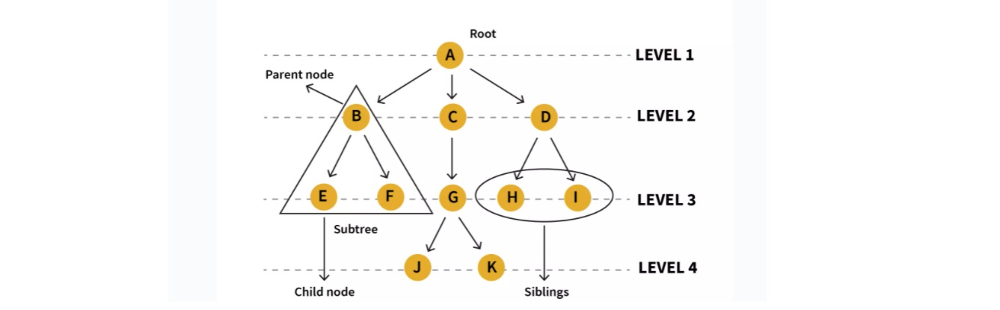
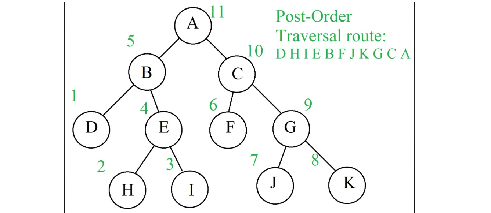
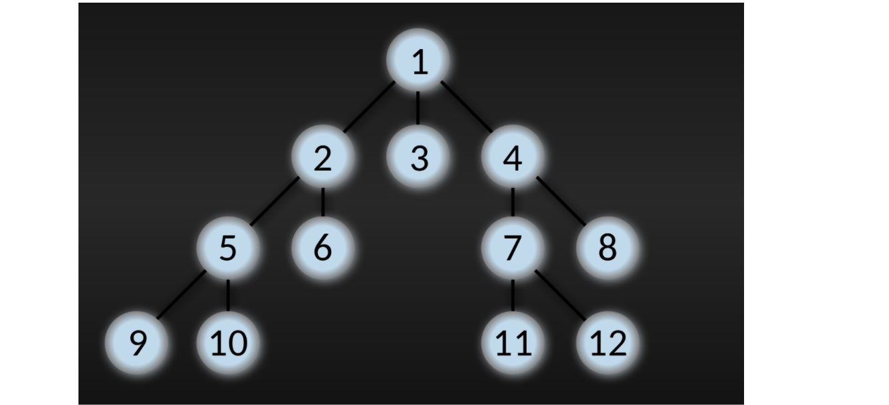
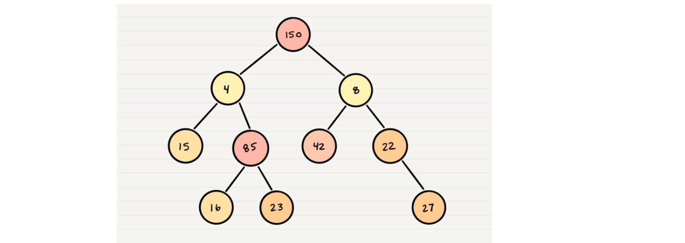
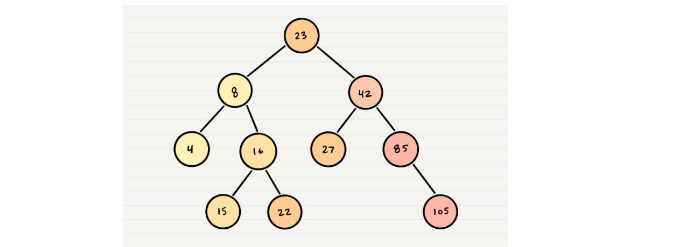
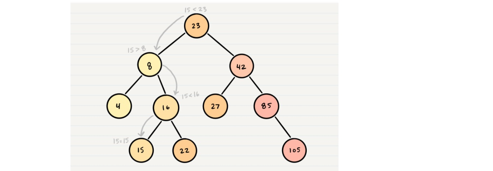

# Trees

#### Common Terminology

#### Traversals

* Depth First
* Breadth First

##### Depth First

* is where we prioritize going through the depth (height) of the tree first

* There are multiple ways to carry out depth first traversal, and each method changes the order in which we search/print the root

#####  Breadth First

* iterates through the tree by going through each level of the tree node-by-node. 

* uses a queue to traverse

##### K-ary Trees

* If Nodes are able have more than 2 child nodes, we call the tree that contains them a K-ary Tree

* we use K to refer to the maximum number of children that each Node is able to have.

##### Binary Search Trees

*  is a type of tree that does have some structure attached to it.

* In a BST, nodes are organized in a manner where all values that are smaller than the root are placed to the left, and all values that are larger than the root are placed to the right.

##### Searching a BST

* Searching a BST can be done quickly because all you do is compare the node you are searching for against the root of the tree or sub-tree

* If the value is smaller, you only traverse the left side. If the value is larger, you only traverse the right side.

