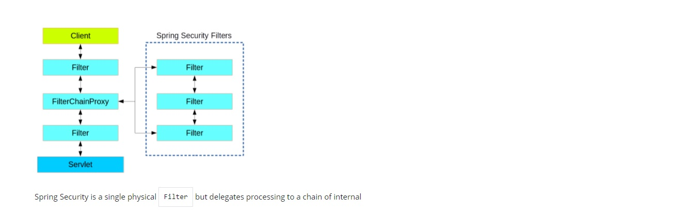
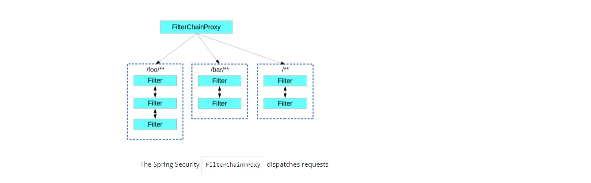

#  Spring Authentication

#### Authentication and Access Control

* Application security boils down to two more or less independent problems:
    * authentication (who are you?)
    * authorization or “access control” (what are you allowed to do?)

###### Authentication
* main strategy interface for authentication is `AuthenticationManager`
>public interface AuthenticationManager {
>
>  Authentication authenticate(Authentication authentication)
>
>    throws AuthenticationException;
>}

* An `AuthenticationManager` can do one of 3 things in its `authenticate()` method:
    * Return an `Authentication` with `authenticated=true` if input is a valid principal
    * Throw an `AuthenticationException`(runtime exception) if  the input is an invalid principal
    * Return `null` if it cannot decide
* most commonly used implementation of `AuthenticationManager` is `ProviderManager`

###### Authorization or Access Control

* Once authentication is successful, we can move on to authorization
* core strategy is `AccessDecisionManager`
* `AccessDecisionVoter` instances  like the `ProviderManager` delegates to AuthenticationProviders
* Most used is the default `AccessDecisionManager`, which is `AffirmativeBased`
* very common to use `ConfigAttributes` that are Spring Expression Language (SpEL)

###### Web Security
* based on Servlet `Filters`
* the typical layering of the handlers for a single HTTP request shown in the picture 

 
* Spring Security is installed as a single `Filter` in the chain
* its concrete type is `FilterChainProxy`
*  the security filter is a `@Bean` in the `ApplicationContext`

* The proxy delegates to a `FilterChainProxy` usually with a fixed name of `springSecurityFilterChain`
* the dispatch happening based on matching the request path `/foo/**` matches before `/**` is shoen in picture

* Each set of resources has its own `WebSecurityConfigurerAdapter` with a unique order and its own request matcher
* you can have more fine-grained control of authorization by setting additional matchers in the `HttpSecurity` configurer
* the access rules are declared using the same format of `ConfigAttribute` strings 
* `AccessDeniedException` shown if access is denied
* If Spring Security is in use, the Principal from the `HttpServletRequest` is of type `Authentication`
* `SecurityContext` is thread-bound