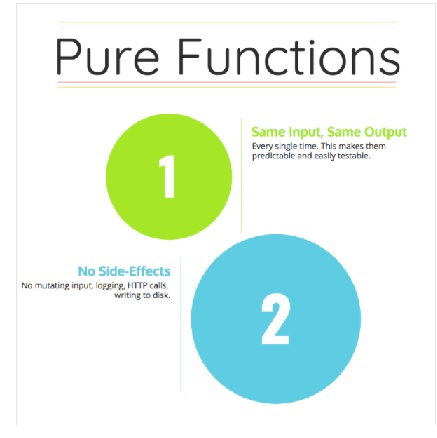
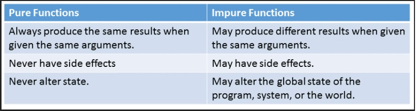
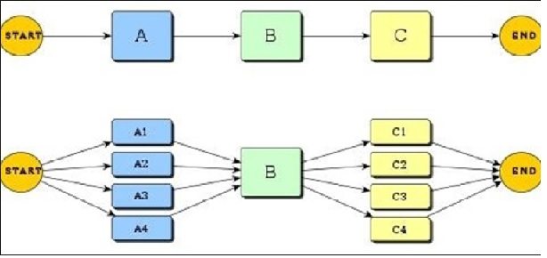
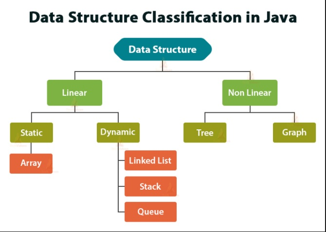

# Spring and Sockets

* a programming paradigm: a style of building the structure and elements of computer programs

* purely functional programming usually designates a programming paradigm that treats all computation as the evaluation of mathematical functions.

* a variable state is passed as an input parameter of a state-transforming function

* function  returns the updated state as part of its return value

* Purely functional programming consists of ensuring that functions, inside the functional paradigm, will only depend on their arguments, regardless of any global or local state. A pure functional subroutine only has visibility of changes of state represented by state variables included in its scope.

## Difference between pure and impure functional programming

## Properties of purely functional programming
* Strict versus non-strict evaluation
* Parallel computing

* Data structures

###  Purely functional language
* A purely functional language is a language which only admits purely functional programming
* Purely functional programs can however be written in languages which are not purely functional.