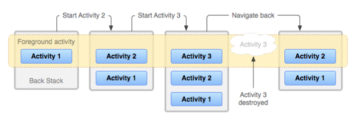
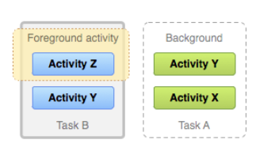

# Intents, Activities, and SharedPreferences

## Tasks and the back stack

* A task is a collection of activities that users interact with when trying to do something in your app
* activities are arranged in a stack—the back stack—in the order in which each activity is opened. 

## Lifecycle of a task and its back stack
* The device Home screen is the starting place for most tasks
* When the icon for an app or shortcut touched, that app's task comes to the foreground
* If no task exists for the app, a new task is created and the main activity for that app opens as the root activity in the stack.
* When the current activity starts another, the new activity is pushed on the top of the stack and takes focus

## Back press behavior for root launcher activities
* When a user presses or gestures Back from a root launcher activity, the system handles the event differently depending on the version of Android that the device is running.
    * System behavior on Android 11 and lower : the system finishes the activity.
    * System behavior on Android 12 and higher: the system moves the activity and its task to the background instead of finishing the activity.

## Background and foreground tasks
* In figure below : Two tasks: Task B receives user interaction in the foreground, while Task A is in the background, waiting to be resumed.

#### Multiple activity instances
* Because the activities in the back stack are never rearranged,A single activity is instantiated multiple times

#### Multi-window environments
* When apps are running simultaneously in a multi-windowed environment, the system manages tasks separately for each window; each window may have multiple tasks

#### Manage tasks
* if want an activity in your app to begin a new task when it is startedor, or when you start an activity, you want to bring forward an existing instance of it, or, you want your back stack to be cleared of all activities except for the root activity when the user leaves the task, you can do them with attributes in the <activity> manifest element and with flags in the intent that you pass to startActivity().

#### Defining launch modes
* You can define different launch modes in two ways:
    * Using the manifest file
    * Using Intent flags

#### Start a task
* You can set up an activity as the entry point for a task by giving it an intent filter with `android.intent.action.MAIN` as the specified action and `android.intent.category.LAUNCHER` as the specified category

# Save key-value data 
* you should use the SharedPreferences APIs if you have a relatively small collection of key-values that you'd like to save

#### Get a handle to shared preferences
* You can create a new shared preference file or access an existing one by calling one of these methods:` getSharedPreferences()`
and `getPreferences()`

#### Write to shared preferences
* To write to a shared preferences file, create a `SharedPreferences.Editor` by calling `edit()` on your `SharedPreferences`.

#### Read from shared preferences
*  call methods such as `getInt()` and `getString()`, providing the key for the value you want, and optionally a default value to return if the key isn't present.