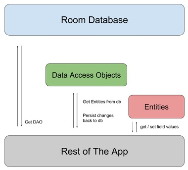
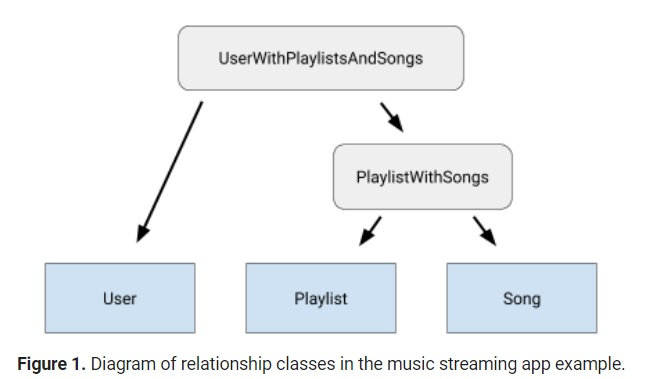

# Room 
## Saving data with Room
* The Room persistence library provides an abstraction layer over SQLite to allow fluent database access while harnessing the full power of SQLite
*  Room provides the following benefits:
    * Compile-time verification of SQL queries.
    * Convenience annotations that minimize repetitive and error-prone boilerplate code.
    * Streamlined database migration paths.

* Primary components:
    *  `database class`
    * `Data entities `
    * `Data access objects (DAOs) `

    the follwoing picture representes a Diagram of Room library architecture
    

## Defining entities in Room
* Each entity corresponds to a table in the associated Room database, and each instance of an entity represents a row of data in the corresponding table
* each Room entity defined as a class that is annotated with `@Entity`
* primary key should defined 

>@PrimaryKey
>
>public int id;
>
*  to make table have a different name, set the tableName property of the `@Entity` annotation
>@Entity(tableName = "users")
>
>public class User {}
*  to make column have a different name, set the tableName property of the ` @ColumnInfo` annotation
> @ColumnInfo(name = "first_name")
>
>    public String firstName;

* to define a composite primary key:
>@Entity(primaryKeys = {"firstName", "lastName"})

* use `@Ignore` to ignore some fields
> @Ignore
>
>    Bitmap picture;

* add the `@Fts3` or `@Fts4` annotation to a given entity, If your app requires very quick access to database information through full-text search (FTS)
* use ` unique` if certain fields or groups of fields in a database must be unique
* you can annotate the class's abstract methods using `@PrimaryKey`, `@ColumnInfo`, `@Embedded`, and `@Relation` When using classes annotated with `@AutoValue` as entities

## Related entities in Room
* You can define relationships between entities, Because SQLite is a relational database
* there are two ways to define and query a relationship between entities:
    * Intermediate data class
        * you define a data class that models the relationship between your Room entities, query methods can then return instances of this data class 
    * Multimap return types
        * you don't need to define any additional data classes, define a multimap return type 
    * you can choose which approach depending on your classes, recommend using Return a multimap.
* you can use the `@Embedded` annotation to represent an object that you'd like to decompose into its subfields within a table

#### Define one-to-one relationships
* create a new data class
* Add the `@Relation` annotation to the instance of the child entity
* use `parentColumn` set to the name of the primary key column of the parent entity 
* `entityColumn` set to the name of the column of the child entity that references the parent entity's primary key
* add the `@Transaction` annotation to this method to ensure that the whole operation is performed atomically.

#### Define one-to-many relationships
* create a new data class 
* Add the `@Relation` annotation to the instance of the child entity
* `parentColumn` set to the name of the primary key column of the parent entity
* `entityColumn` set to the name of the column of the child entity that references the parent entity's primary key
* add the @Transaction annotation to this method to ensure that the whole operation is performed atomically

#### Define many-to-many relationships
* Many-to-many relationships are distinct from other relationship types because there is generally no reference to the parent entity in the child entity
* create a third class to represent an associative entity, must have columns for the primary key from each entity in the many-to-many relationship 
* create a new data class that contains one class object and a list of the other 
* add the `@Transaction` annotation to both methods to ensure that the whole operation is performed atomically

#### Define nested relationships

#### Accessing data with Room
##### Anatomy of a DAO
* The Data Access Object is basically an object or an interface that provides access to an underlying database or any other persistence storage.
* you must always annotate your DAOs with `@Dao`

##### Convenience methods
* The `@Insert` annotation allows you to define methods that insert their parameters into the appropriate table in the database
* The `@Update` annotation allows you to define methods that update specific rows in a database table.
* The `@Update` annotation allows you to define methods that update specific rows in a database table
* The `@Delete` annotation allows you to define methods that delete specific rows from a database table
* `Query methods` : allows you writting your own SQL query and interacting with the database.