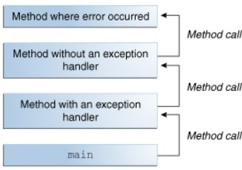
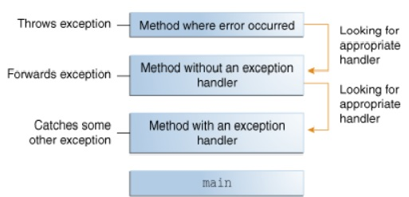

#  Maps, primitives, File I/O

### Java Type System
Java has a two-fold type system consisting of primitives such as int, boolean and reference types such as Integer, Boolean. Every primitive type corresponds to a reference type.

* wrapper classes are immutable: once the object is constructed their state can't change and final: can't be inherit from them

* autoboxing: converting a primitive type to a reference.

* unboxing: converting a reference type to a primitive.

>Integer j = 1;          // autoboxing
>
>int i = new Integer(1); // unboxing

###   Pros and Cons

what object is to be used is based on what application performance, available memory, default values we should handle

### Single Item Memory Footprint

* primitive types:
    *  boolean – 1 bit
    * byte – 8 bits
    * short, char – 16 bits
    * int, float – 32 bits
    * long, double – 64 bits

 primitive Variables of these types live in the stack and hence are accessed fast

* reference types:
    * Boolean – 128 bits
    * Byte – 128 bits
    * Short, Character – 128 bits
    * Integer, Float – 128 bits
    * Long, Double – 192 bits

 reference types are objects, live on the heap and are relatively slow to access.

 ### Memory Footprint for Arrays

 * arrays of long and double of the primitive types consume more memory than Long and Double in wrapper classes 

* single-element arrays of primitive types are almost always more expensive (except for long and double) than the corresponding reference type.

###  Default Values

* For the wrapper classes, the default value is null.

* reference types might acquire a value (null) that in some sense doesn't belong to their domains which may cause errors if they didn't uninitialized.

### usage 

Java language specification doesn't allow usage of primitive types in the parametrized types (generics) in the Java collections or the Reflection API.

-----------------------------------------------------------------

# Exceptions

### What Is an Exception?

Exception: is for  "exceptional event", it is an event occurs during the execution of a program, disrupts the normal flow of the program's instructions.

when an error occured in method it create an object called "exception object"  and hands it off to the runtime system

* it contains information about error : type,state of the program when the error occurred

* throwing an exception:  Creating an exception object and handing it to the runtime system

* call stack: The set of possible "somethings" to handle the exception is the ordered list of methods that had been called to get to the method where the error occurred

* exception handler: a block of code that can handle the exception

*  If the runtime system exhaustively searches all the methods on the call stack without finding an appropriate exception handler,the program terminates.

### The Catch or Specify Requirement

Code that might throw certain exceptions must be enclosed by either of the following:
- A try statement that catches the exception

- A method that specifies that it can throw the exception

* Code that fails to honor the Catch or Specify Requirement will not compile.

* Not all exceptions are subject to the Catch or Specify Requirement. 

## Three Kinds of Exceptions

* checked exception: These are exceptional conditions that a well-written application should anticipate and recover from, Checked exceptions are subject to the Catch , All exceptions are checked exceptions, except for those indicated by Error, RuntimeException, and their subclasses.

* error: exceptional conditions that are external to the application, and that the application usually cannot anticipate or recover from

* runtime exception: exceptional conditions that are internal to the application, and that the application usually cannot anticipate or recover from, these usually indicate programming bugs, such as logic errors or improper use of an API

Errors and runtime exceptions are collectively known as unchecked exceptions.

### How to Throw Exceptions

* The FileWriter constructor throws IOException, which must be caught. 

* get(int) method throws IndexOutOfBoundsException, which must be caught.

* compiler prints an error message about the exception thrown by the FileWriter constructor

* IOException, is a checked exception,

* IndexOutOfBoundsException, is an unchecked exception.

-----------------------------------------------------------------
## Using Scanner to read in a file in Java

* Objects of type Scanner are useful for breaking down formatted input into tokens and translating individual tokens according to their data type

* By default, a scanner uses white space to separate token
    * White space characters include blanks, tabs, and line terminators

    * To use a different token separator, invoke useDelimiter()

