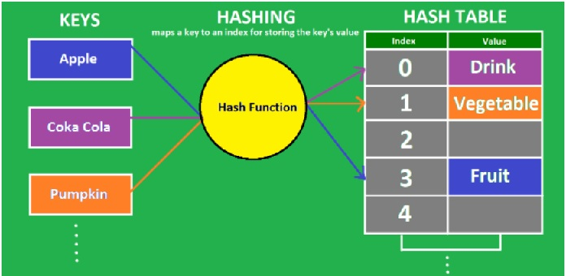
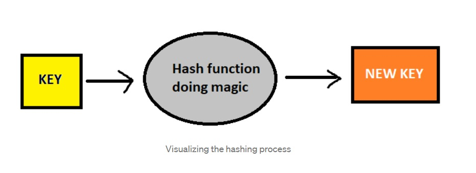
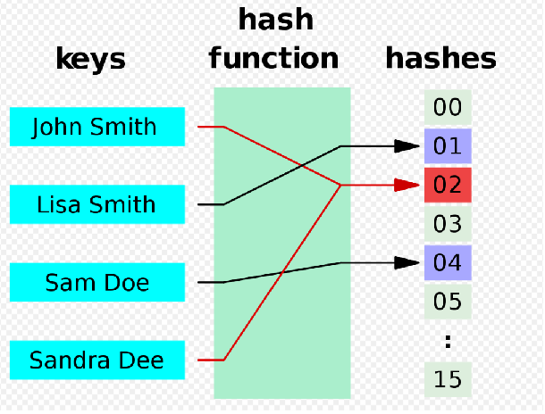
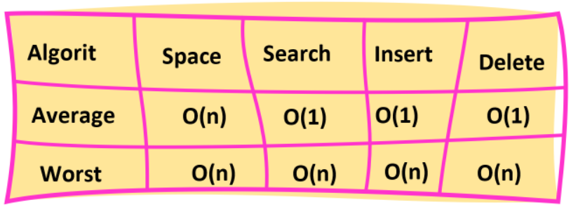

# Hashtables
## What is a Hashtable?

* is a data structure that implements a set abstract data type, a structure that can map keys to values
* A hash table uses a hash function to compute an index, also called a hash code, into an array of buckets or slots, from which the desired value can be found.
* Hashtables are a data structure that utilize key value pairs. This means every `Node` or `Bucket` has both a `key`, and a `value`.

### what is Hashing?
*  the process of converting a given key into another value, with the help of a hash function.
* A hash function is a mathematical algorithm which helps generate a new value for a given input

### Creating a Hash
* create an array
* do some sort of logic to turn that “key” into a numeric number value. 

### Collisions
* A collision occurs when more than one key hashes to the same index in an array.

* Collisions are solved by changing the initial state of the buckets.we can initialize a LinkedList in each one!, Instead of starting them all as null 

### Internal Methods
* Add()
* Find()
* Contains()
* GetHash()

### Good Hash Functions
* Division Method
* Multiplication Method
* Universal Hashing

### time complixity

