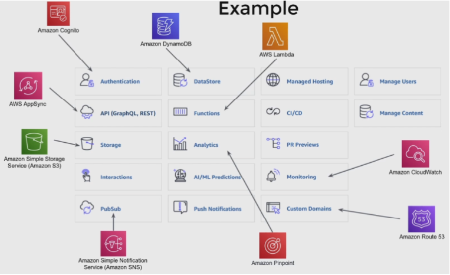
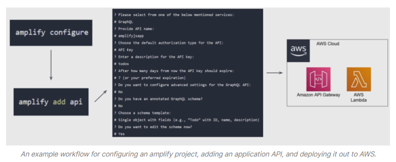
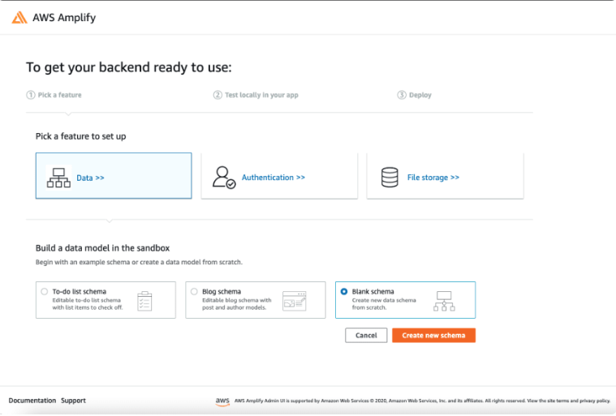
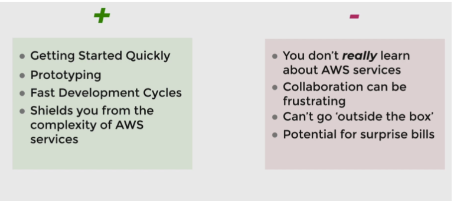

# Espresso
### What is AWS Amplify?
* Amplify offered something other product’s didn’t: direct feature integration with AWS’ powerful backend services.
* doesn’t offer any particular core functionality besides helping you integrate with other AWS services
* AWS Amplify is a toolchain that helps you build and deploy entire applications very quickly.
* mainly aimed at full stack applications, but you can also use it just for its ability to generate a backend.

### What’s included in AWS Amplify?
* Data storage
* Analytics
* Push notifications
* Authentication

### Who should use AWS Amplify?
* for people who don’t want to build their backend or other components from scratch.

### Amplify Features
* This is a big list of impressive things you can do with Amplify

### Amplify Usage

#### Command Line Interface (CLI)

#### Admin UI

### Pros and Cons

