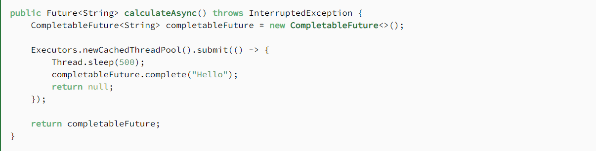

# GraphQL @connection
### Has Many relationship
The `@hasOne` and `@hasMany` directives do not support referencing a model which then references the initial model via `@hasOne` or `@hasMany` if DataStore is enabled.
* Create a one-directional one-to-many relationship between two models using the `@hasMany` directive.

* To customize the specific secondary index used for the "has many" relationship: 

* configure a secondary index using `@index`
* Then, pass in the secondary index name `indexName` parameter and the respective `fields` which match the connected index

### CompletableFuture in Jav
* the CompletableFuture class implements the Future interface
* we can use it as a Future implementation, but with additional completion logic.

* the code below a method that creates a CompletableFuture instance, then spins off some computation in another thread and returns the Future immediately.

* Executor API method creating and completing a CompletableFuture can be used together with any concurrency mechanism or API, including raw threads.

* the calculateAsync method returns a Future instance.

* If we already know the result of a computation, we can use the static completedFuture method with an argument that represents a result of this computation. 
