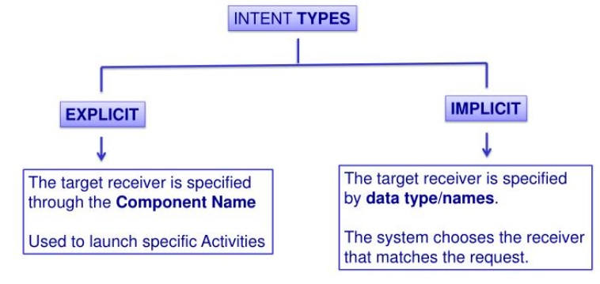
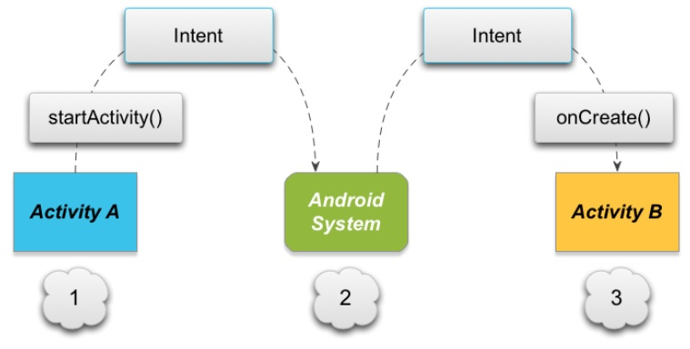
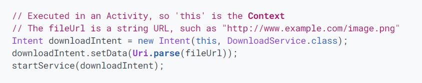
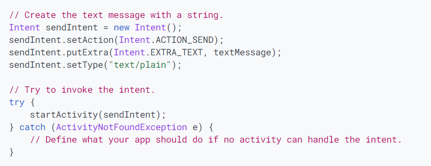

# Notifications
## Allowing Other Apps to Start Your Activity 
* your app should be prepared to respond to action requests by specifying the appropriate intent filter in your activity
* should support the ACTION_SEND intent.
* add an <intent-filter> element in your manifest file

## Add an Intent Filter
* criteria of the `Intent` object:
    * Action 
    * Data
    * Category

    * To Handle the Intent call `getIntent()` to retrieve the Intent that started the activity
    * To return a result call `setResult()` to specify the result code and result `Intent`

## Intents and Intent Filters 
* An `Intent` is a messaging object you can use to request an action from another app component
* fundamental use cases to facilitate communication between components:
    * Starting an activity
    * Starting a service
    * Delivering a broadcast

#### Intent types
 

* the picture below shows how an implicit intent is delivered through the system to start another activity: 
* Activity A creates an Intent with an action description and passes it to startActivity().
* The Android System searches all apps for an intent filter that matches the intent. When a match is found,
*  the system starts the matching activity (Activity B) by invoking its onCreate() method and passing it the Intent.

#### Example explicit intent

#### Example implicit intent

