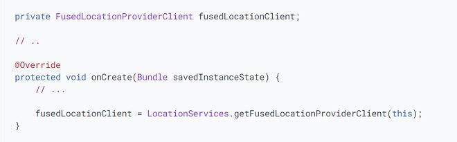

# Get the last known location
* Using the Google Play services location APIs, your app can request the last known location of the user's device.
* use the fused location provider to retrieve the device's last known location. 

## Set up Google Play services
* Download and install the Google Play services component via the SDK Manager 
* add the library to your project

## Specify app permissions
* must request location permissions

## Create location services client

## Get the last known location
* call the getLastLocation() method.

## Choose the best location estimate
* Choose from one of the following:
    * getLastLocation(): gets a location estimate more quickly and minimizes battery usage that can be attributed to your app
    * getCurrentLocation() :gets a fresher, more accurate location more consistently.