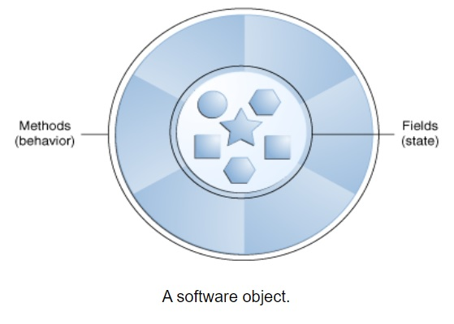
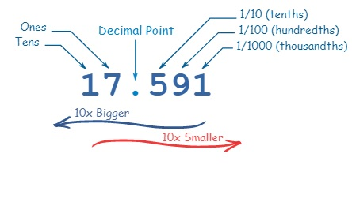
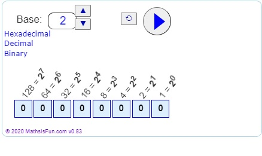
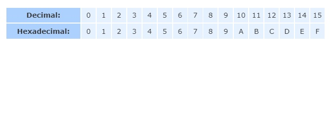

# Object-Oriented Programming Concepts

### What Is an Object?

- In order to understand object oriented you need to understand objects, examples of object around us: dog, desk, television set and bicycle.

- Real-world objects share two characteristics: They all have state and behavior

- some objects, in turn, will also contain other objects.

   

- Software objects are similar to real-world objects: they too consist of state and related behavior, it stores its state in fields (variables), and exposes its behavior through methods

- data encapsulation: a fundamental principle of object-oriented programming, hiding internal state and requiring all interaction to be performed through an object's methods

- benefits of bundling code into individual software objects:
    * Modularity:  Once created, an object can be easily passed around inside the system
    * Information-hiding: interacting with an object's methods only, details of its internal implementation remain hidden 
    * Code re-use: allows specialists to implement/test/debug complex, task-specific objects to trust run on your code
    * Pluggability and debugging ease: if object turns out to be problematic, you can simply remove it 

    -----------------------------------------------------------------------------------------------------------------------------------

### What Is a Class?

In the real world, you'll often find many individual objects all of the same kind, each object was built from the same set of classes and therefore contains the same components.

an example: 
 -   your bicycle is an instance of the class of objects known as bicycles

-  A class is the blueprint from which individual objects are created.

-------------------------------------------------------------------------------------------------------------------------------------------

###  Binary, Decimal and Hexadecimal Numbers

#### Decimals

* Every digit in a decimal number has a "position"
*  the decimal point helps us to know which position is which
* Every position further to the left is 10 times bigger
* every position further to the right is 10 times smaller

 

#### Bases

*  Decimal Number System is also called "Base 10", because it is based on the number 10, with these 10 symbols:0, 1, 2, 3, 4, 5, 6, 7, 8 and 9

    * there is no symbol for "ten": it is two symbols together: 0 and 1 

#### Counting with Different Number Systems

* You could use 2 ("Binary"), 16 ("Hexadecimal"), or any number you want to!
* only two digits 0 and 1 

#### Hexadecimal Numbers

* the same as the decimal numbers up to 9, but then there are the letters ("A',"B","C","D","E","F") in place of the decimal numbers 10 to 15.

