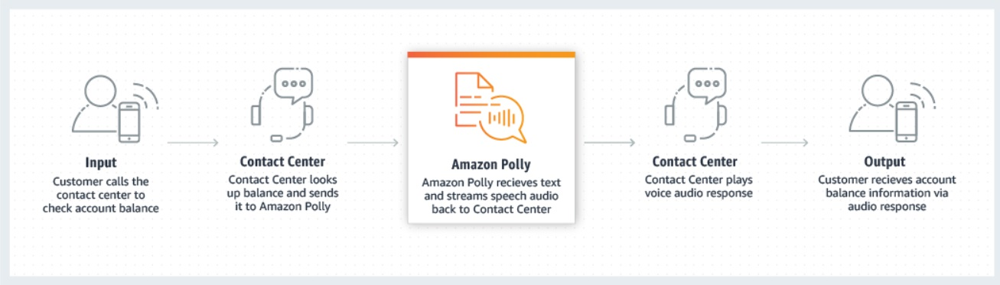

# Amazon Pinpoint and Amazon Polly
## Amazon Pinpoint
* a flexible and scalable outbound and inbound marketing communications service
* can connect with customers over channels like email, SMS, push, voice or in-app messaging

### properities
* easy to set up
* easy to use
* flexible for all marketing communication scenarios

### Benefits
* Get started quickly
* Segment and personalize for impact
* Measure your efficiency
* Scale securely with the experts

### How it works

## Amazon Polly
* a cloud service that converts text into lifelike speech.
* used to develop applications that increase engagement and accessibility

### Benefits
* High quality
* Low latency
* Support for a large portfolio of languages and voices 
* Cost-effective
* Cloud-based solution 

### How it works
* Example: Text-to-speech for telephony systems

