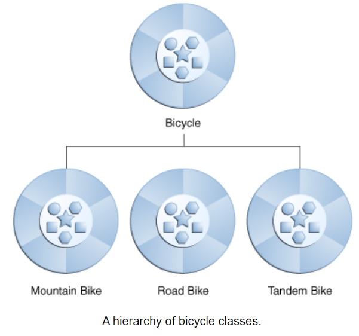

# Inheritance and Interfaces

## What Is Inheritance?

* Different kinds of objects often have a certain amount in common with each other

Object-oriented programming allows classes to inherit commonly used state and behavior from other classes

axample: (Mountain bikes, road bikes, and tandem bikes) all share the characteristics of bicycles
*  current speed
*  current pedal cadence
*  current gear
 
each also defines additional features that make them different: 
*  tandem bicycles have two seats and two sets of handlebars
*  road bikes have drop handlebars
*  some mountain bikes have an additional chain ring, giving them a lower gear ratio.

in the example above:
* Bicycle called *superclass* of (MountainBike, RoadBike, and TandemBike)

* (MountainBike, RoadBike, and TandemBike) are called *subclasses*

* each class is allowed to have one direct superclass

* each superclass has the potential for an unlimited number of subclasses

* use the extends keyword at the beginning of class declaration for creating a subclass 

>class MountainBike extends Bicycle {
>
>    // new fields and methods defining 
>
>    // a mountain bike would go here
>
>}

* This gives MountainBike all the same fields and methods as Bicycle

-------------------------------------------------------------------------------------------------------------------------------------------
## What Is an Interface?

* interface is a group of related methods with empty bodies

* Methods form the object's interface with the outside world: 

    * buttons on the front of television set, are the interface between you and the electrical wiring

    * press the "power" button to turn the television on and off

 A bicycle's behavior specified as an interface as follow: 

>  interface Bicycle {
>
>    //  wheel revolutions per minute
>
>    void changeCadence(int newValue);
>
>    void changeGear(int newValue);
>
>}

* To implement this interface change the name of class (to a particular brand of bicycle as: ACMEBicycle 
*  use the implements keyword in the class declaration

>class ACMEBicycle implements Bicycle {
>
>    int cadence = 0;
>
>    int speed = 0;
>
>    void changeCadence(int newValue) {
>
>         cadence = newValue;
>    }
>
>    void changeGear(int newValue) {
>
>         gear = newValue;
>    }
>
>}

*  an interface allows a class to become more formal about the behavior  to provide

* all methods defined by that interface must appear in its source code before the class will successfully compile

----------------------------------------------------------------------------------------------------------------------------------------------
## What Is a Package?

* a namespace that organizes a set of related classes and interfaces

* software written in the Java programming language can be composed of hundreds or thousands of individual classes

* it makes sense to keep things organized by placing related classes and interfaces into packages.

* Java platform provides an enormous class library (a set of packages) for use in an applications called "Application Programming Interface" or "API"

* examples:

    * a String object contains state and behavior for character strings

    * a File object allows a programmer to easily create, delete, inspect, compare, or modify a file on the filesystem

    * a Socket object allows for the creation and use of network sockets
    
    * various GUI objects control buttons and check boxes and anything else related to graphical user interfaces
