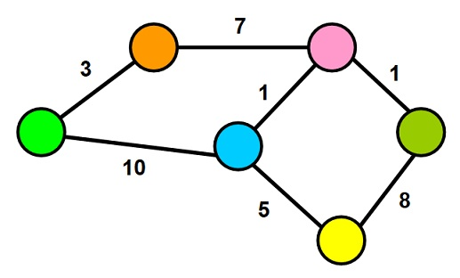

# Graphs
* a non-linear data structure
* a collection of `vertices` (`nodes`) connected by line segments named `edges`.

* terminology used when working with Graphs:
    * Vertex (node): can have zero or more adjacent vertices.
    * Edge: connection between two nodes.
    * Neighbor: adjacent nodes, connected via an edge.
    * Degree: number of edges connected to that vertex

## Directed vs Undirected
* Undirected Graph is a graph where each edge is undirected or bi-directional.
* Directed Graph also called a Digraph is a graph where every edge is directed.

## Complete vs Connected vs Disconnected
* `complete graph` is when all nodes are connected to all other nodes.
* `connected graph` is graph that has all of vertices/nodes have at least one edge.
* `disconnected graph` is a graph where some vertices may not have edges.

## Acyclic vs Cyclic
* `acyclic graph` is a directed graph without cycles.
* `Cyclic graph` is a graph that has cycles.

## Graph Representation
* Matrix :
* Adjacency List

## Weighted Graphs
* a graph with numbers assigned to its edges(called weights)

## Graph Traversals

