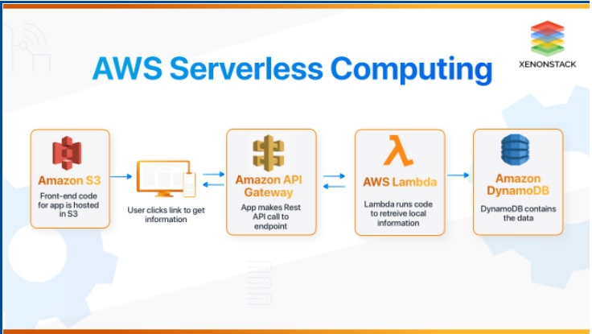
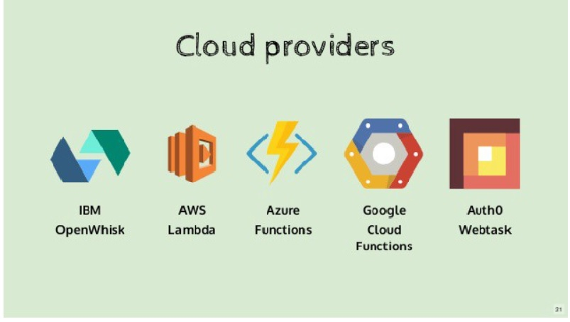
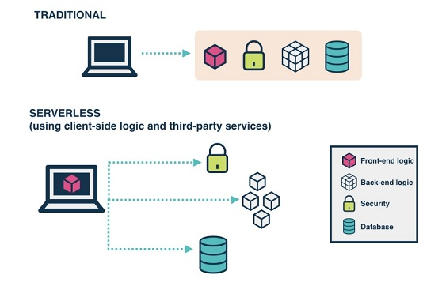
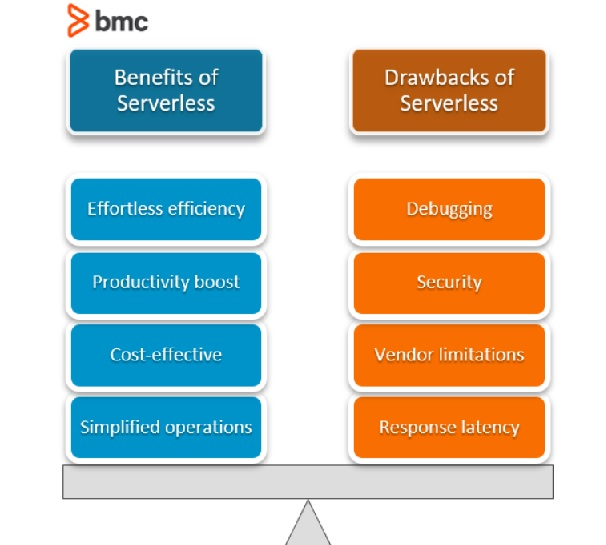
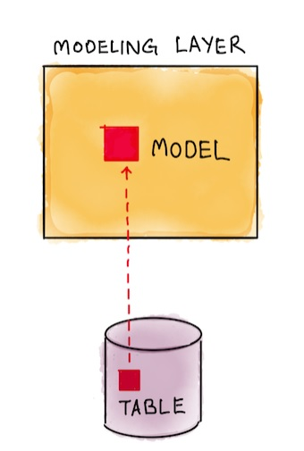

# Serverless and Amplify
### What is Serverless?

* Serverless is a term used to describe the services, practices, and methods that allow you to create more agile apps that allow you to adapt and react to change more quickly.

* Here are some of the currently available cloud services:

### Traditional vs. Serverless Architecture
* regardless the cool features of Serverless in some cases, the traditional architecture outshines it.

* Pricing: The winner here is Serverless Architecture.
* Networking : The winner here is Traditional Architecture.
* 3rd Party Dependencies : Traditional Architecture is the winner.
* Environments: The winner here is Serverless Architecture.
* Timeout: The clear winner here is Traditional Architecture.
* Scale: It’s a tie between Serverless and Traditional Architecture.

### Functions as a Service (FaaS)
* FaaS is an implementation of Serverless architectures where engineers can deploy an individual function or a piece of business logic
* Principles of FaaS:
    Complete management of servers
    Invocation based billing
    Event-driven and instantaneously scalable

### Benefits of Serverless Architecture

### API (GRAPHQL)
#### Data modeling
##### what is Data modeling

* Amplify automatically creates Amazon DynamoDB database tables for GraphQL types annotated with the `@model` directive in your GraphQL schema.
* `@model` will also automatically add an id field as a primary key to the database table.
* `@model` also adds the helper fields `createdAt` and `updatedAt` to your type. The values for those fields are read-only by clients unless explicitly overwritten.