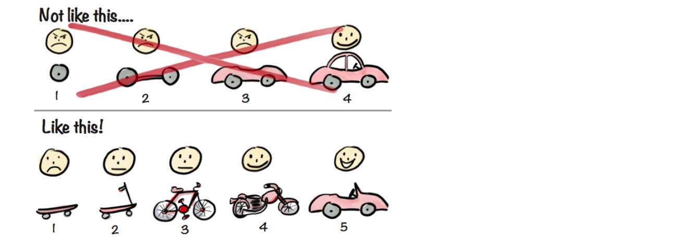

# OO Design 

## General code design principles

### Don't repeat yourself principle

* this means (don’t write the same code repeatedly)

This principle aims to reduce repetition of software development, to avoid this use *abstraction* or data *normalization* 

example : for the following program the company provide the service of wash car after it's services, make the wash as separate methode and call it wherever you need instead of writing code each time 

>public class Mechanic {
    >
	>public void serviceBus() {
        >
		>System.out.println("Servicing bus now");
        >
        >        //Process washing
        >
	>}
    >
	>public void serviceCar() {
        >
	>	System.out.println("Servicing car now");
    >
     >           //Process washing
     >
	>}
>}

instead of previous code  Do the following one: 

>public class Mechanic {
    >
	>public void serviceBus() {
        >
	   >	System.out.println("Servicing bus now");
       >
           >     washVehicle();
           >
	>}
	>public void serviceCar() {
        >
		>System.out.println("Servicing car now");
        >
                >washVehicle();
                >
	>}
    >
        >public void washVehicle() {
            >
               >//Process washing
               >
	>}
    >
>}

-------------------------------------------------------------------------------------------------------------------
###  Rule of three principle

* to decide when similar pieces of code should be refactored to avoid duplication

* when similar code is used three times, it should be extracted into a new procedur

* when the code duplicated, maintains the code will have to change it in all places correctly.

-------------------------------------------------------------------------------------------------------------------

### You aren't gonna need it principle

* implement things when you actually need them

*  "do the simplest thing that could possibly work" 

* It’s an approach that aenabled me to redesign and rebuild

* Look at each item and ask yourself if you really need it?, Not if you might need it, but if things WILL BE COMPLETELY BROKEN without it.

--------------------------------------------------------------------------------------------------------------------

### Minimum viable product principle

* a development technique in which there is a product discovery or website is developed with sufficient features to satisfy early adopters

* A minimum viable product has just enough core features to effectively deploy the product, and no more

* Perpose of principle : 

    * Be able to test a product hypothesis with minimal resources

    * Reduce wasted engineering hours

    * To establish a builder's abilities in crafting the product required
 
 example 

 

    
