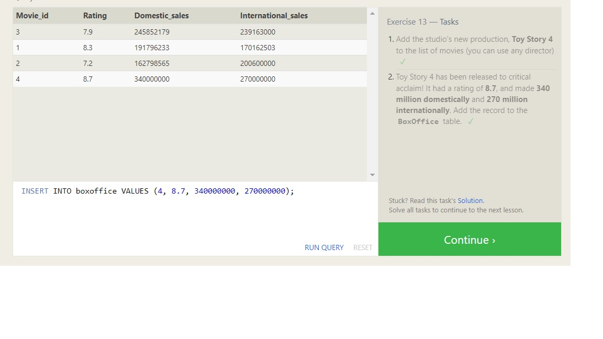

#Introduction To Structured Query Language (SQL)

Is a language allows you to query, manipulate, and transform data from a relational database

- examples of Structured Query Language: SQLite, MySQL, Postgres, Oracle and Microsoft SQL Server
- To learn sql must know the Relational databases before, it is a set of tables each one consists from rows and columns
- the goal is to know how to answer about sql queries create quires
- Table is called *schema*

## SELECT queries
Select is used to retrive data from database, you can select all the table or part of it depending on columns
to retrive part of table:
> SELECT column, another_column, … FROM table;

to select all table 
> SELECT * FROM table;

-------------------------------------------------------------------------------------------
## Queries with constraints
If we have a very big table, we can use WHERE to specify condition for which rows to return

> SELECT col1,col2,... FROM table WHERE condition1,condition2,...;

|Operator                |Condition                       | Example                         |
|:---                    | :---:                          | :---:                           |
|=, !=, < <=, >, >=      |numerical operators             |col > 3                          |
|BETWEEN … AND …         |number in a range               |col BETWEEN 3 AND 7              |
|NOT BETWEEN … AND...    |number not in range             |col NOT BETWEEN 3 AND 7          |
|IN (…)                  |number exist in list            |col IN (5,6,7,8)                 |
|NOT IN (…)	             |number  not exist in list       |col NOT IN (5,6,7,8)             |
|=       	             |equals to                       |col ="year"                      |
|!= or <>	             |not equal to                    |col != "year"                    |
|LIKE    	             |exact string comparison         |col LIKE "year"                  |

------------------------------------------------------------------------------------------------------------
## Filtering results of quires

- DISTINCT :discard rows that have a duplicate column value
> SELECT DISTINCT col1, col2, … FROM table WHERE condition(s);

- ORDER BY: sort your results by a given column in ascending or descending order
> SELECT col1, col2, … FROM table WHERE condition(s) ORDER BY col ASC/DESC;

- LIMIT:  reduce the number of rows to return
- OFFSET:  specify where to begin counting the number rows from

> SELECT col1, col2, … FROM table WHERE condition(s) ORDER BY col ASC/DESC LIMIT num OFFSET num;

- create: creating a new table (schema) in database

- NULL: good to reduce the possibility of NULL values in databases

- INSERT: add data to the table

- join : used to join tables, it have many parts: INNER JOIN, LEFT JOIN, RIGHT JOIN,FULL JOIN 

- update: used to update on the table

- delete : delete from a table 

Drop : delete all the table 

