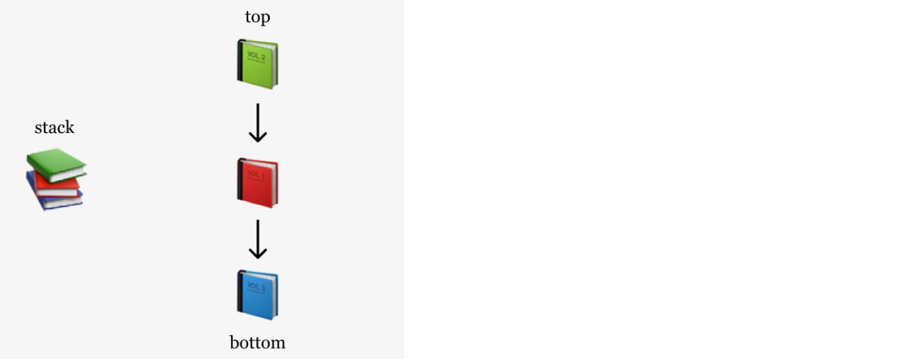
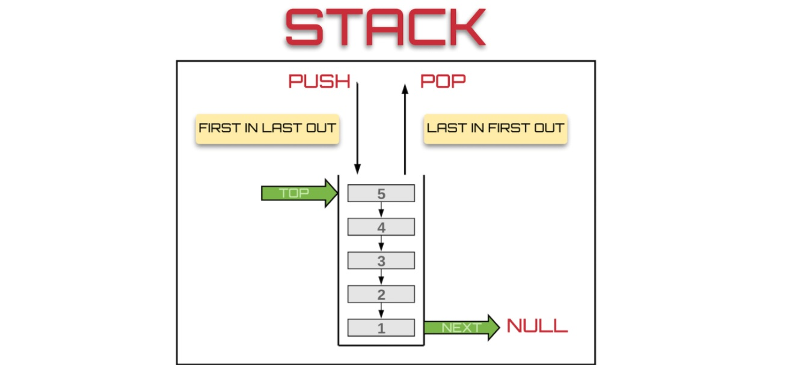
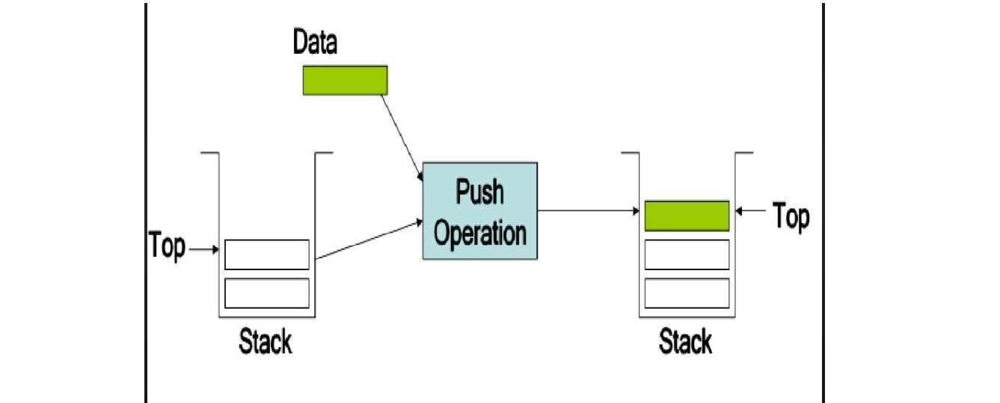
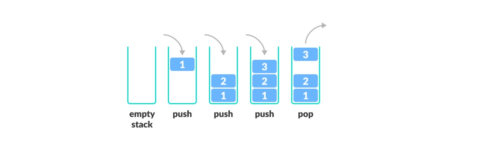
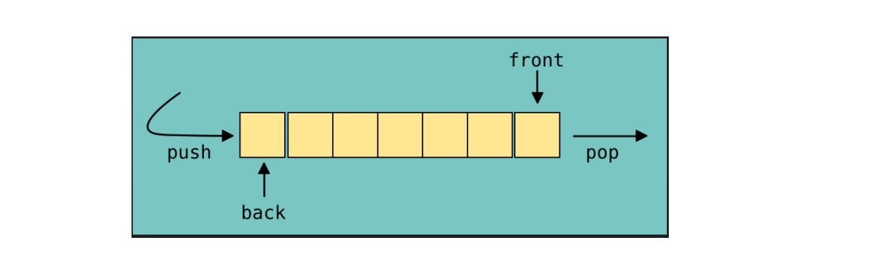
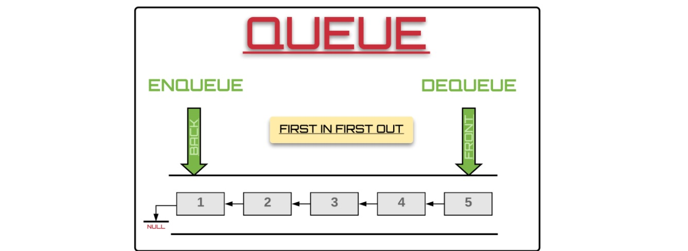
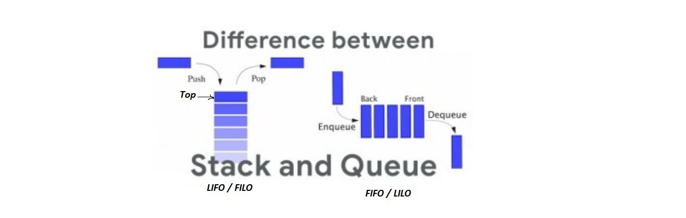

# Stacks and Queues

### What is a Stack

* a data structure that consists of Nodes

* Each Node references the next Node in the stack, but does not reference its previous.

* any insertion or deletion will be on the top of stack 

* Stack concepts: 

    * FILO (first item added in the stack will be the last item popped out of the stack)

    * LIFO (last item added to the stack will be the first item popped out of the stack)

* stack terminology

    * Push: put items into the stack 
    * Pop : remove items from the stack
    * top:the top of the stack
    * Peek :view the value of the top Node
    * IsEmpty: returns true when stack is empty otherwise returns false.

    

    

### What is a Queue

* Abstract Data Type or a linear data structure.

* queue concepts: 

    * FIFO (first item added in the queue will be the first item popped out of the queue)

    * LILO (last item added to the queue will be the last item popped out of the queue)

* queue terminology: 
    * Enqueue: Nodes added to the queue
    * Dequeue: Nodesremoved from the queue
    * Front: front/first Node of the queue
    * Rear: This is the rear/last Node of the queue.
    * Peek: view the value of the front Node in the queue
    * IsEmpty: returns true when queue is empty otherwise returns false

## difference between stack and queue

